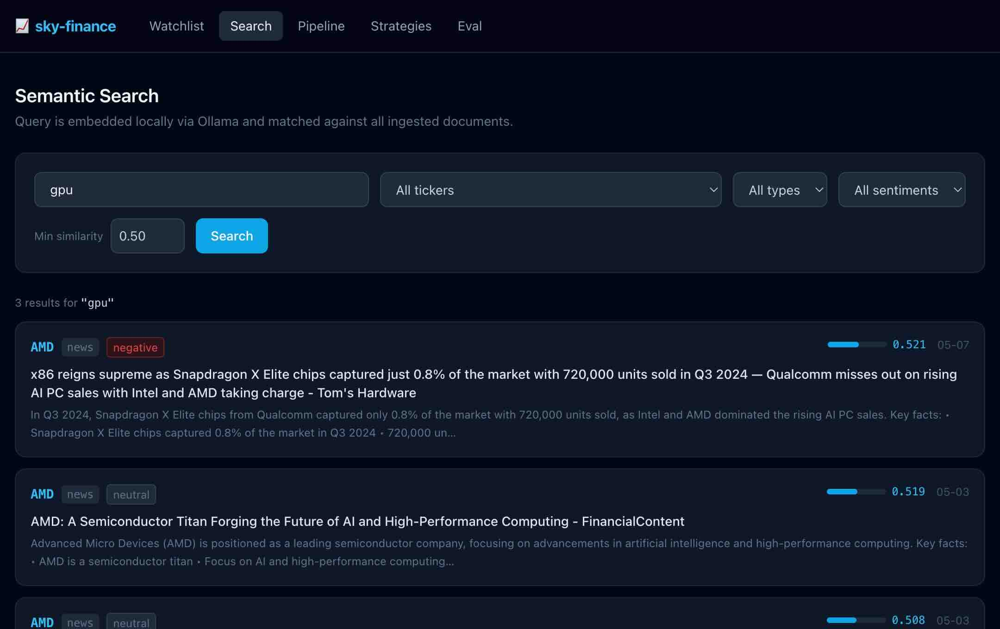
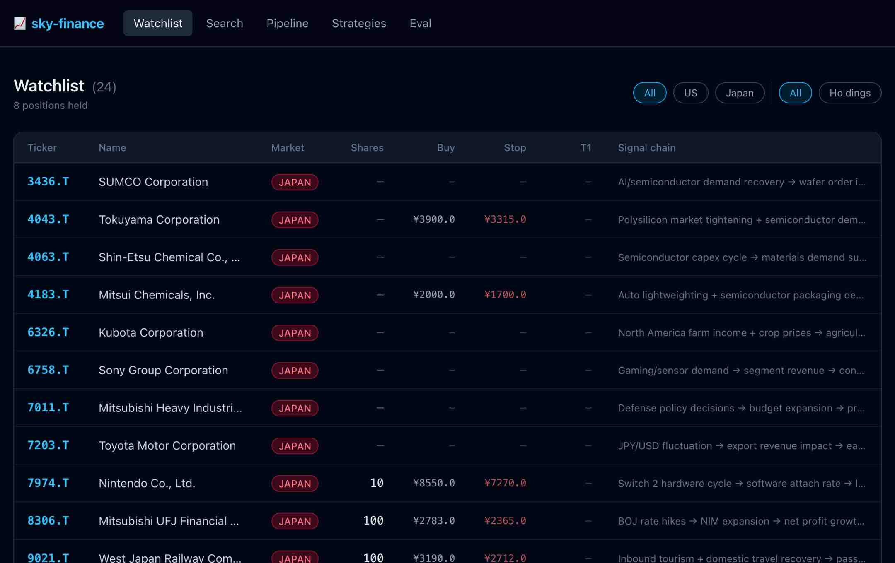
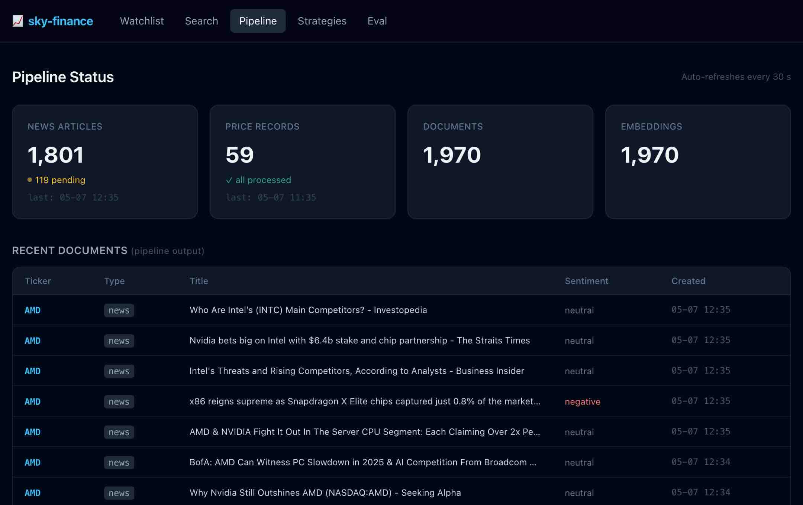
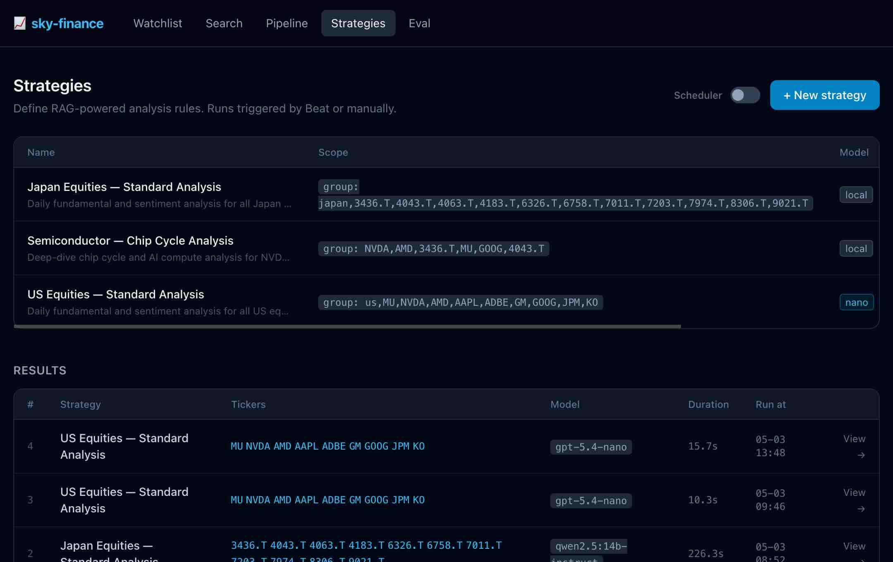
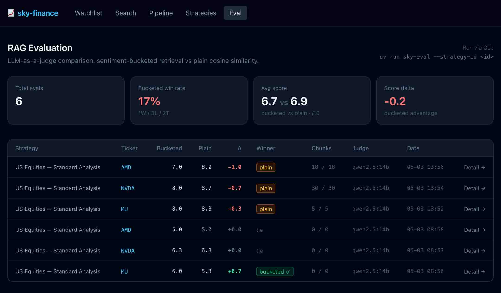

# sky-finance

> **This is the full production follow-up to the [SkyFinance POC](https://wangpeifeng.com/blogs/SkyFinance%3A%20I%20Built%20a%20Personal%20Stock%20Alert%20System%20with%20Local%20LLMs%20and%20Cloud%20AI) — a personal stock alert system built around a 6-step pipeline that ran twice every trading day for ~$0.50/month in cloud API costs.**
>
> The POC validated the core idea: use a local 7B model for per-ticker news filtering and classification (free), reserve frontier models only for cross-holding portfolio synthesis (cheap), and wire everything together with a disciplined cost boundary. This repository takes that architecture further — replacing the script-based pipeline with a proper task queue (Celery + Redis), adding persistent vector storage (PostgreSQL + pgvector) for RAG-powered strategy analysis, a web dashboard, LLM-as-a-judge evaluation, and multi-provider model support.

> **⚠️ Disclaimer:** This project is for educational and research purposes only. It does not constitute financial or investment advice. The AI-generated analysis and strategies should not be used as the sole basis for real-world trading decisions. Do your own research (DYOR).

A local-first financial intelligence platform for monitoring US and Japanese equities,
cleaning market data with a local LLM, and generating RAG-powered strategy analysis
with multi-provider model support (Ollama / OpenAI / Anthropic Claude).

## Features

- **Data Ingestion** — market data via `yfinance`, news via Google RSS
- **Data Cleaning Pipeline** — Python pipeline + local 4–7B LLM (Ollama)
- **Vector Storage** — PostgreSQL + pgvector in Docker for semantic search
- **Web Dashboard** — watchlist, pipeline status, strategies, evaluation results
- **Strategy Engine** — define strategies, run RAG queries, stream AI-powered analysis
- **Multi-Provider LLM** — Ollama (local) / OpenAI / Anthropic Claude with a single tier abstraction
- **Structured Output** — OpenAI `response_format: json_schema`, Anthropic `tool_use`, Ollama `format: <schema>` — no manual JSON parsing
- **Prompt Caching** — Claude `cache_control: ephemeral` (~90% cost reduction on repeated system prompts); OpenAI automatic caching with cache-hit logging
- **Cost Tracking** — every LLM call records `input_tokens`, `output_tokens`, `cached_tokens`, and `cost_usd` to `strategy_results.metadata`; surfaced in the dashboard
- **Hybrid RAG Retrieval** — BM25 keyword search + cosine vector search fused with Reciprocal Rank Fusion (RRF); per-strategy `retrieval_mode` switch
- **RAG Evaluation** — LLM-as-a-judge comparison of sentiment-bucketed vs plain retrieval
- **Slack Notifications** — push results and alerts to Slack
- **Task Queue** — Celery + Redis for async, retryable, observable workflows

## Architecture

### Data Flow

```
┌─────────────────────────────────────────────────────────────────────────┐
│  INGESTION                                                              │
│                                                                         │
│  yfinance (sync, one task/ticker) ──────────────────┐                  │
│  Google RSS L1-EN ──┐                               ├──▶ PostgreSQL    │
│  Google RSS L2-EN ──┤ concurrent via httpx.Async-   │    (raw_data,    │
│  Google RSS L1-JA ──┤ Client + asyncio.gather       │    news_raw)     │
│  Google RSS L2-JA ──┘ (Japan tickers only)   ───────┘                  │
└────────────────────────────────────┬────────────────────────────────────┘
                                     │  unprocessed rows
                                     ▼
┌─────────────────────────────────────────────────────────────────────────┐
│  PIPELINE  (Celery task per record)                                     │
│                                                                         │
│  cleaner.py ──▶ llm_summariser.py ──────────────────▶ embedder.py      │
│  Strip HTML    Ollama qwen2.5:3b-instruct             nomic-embed-text  │
│  Norm WS       → summary                             → 768-dim vector   │
│  Truncate 2k   → sentiment (+/=/-)                                      │
│  chars         → key_facts, topics                                      │
│                → relevance_score                                        │
│                                     │                    │              │
│                                     ▼                    ▼              │
│                              documents table      embeddings table      │
│                              (PostgreSQL)         (pgvector)            │
└────────────────────────────────────┬────────────────────────────────────┘
                                     │  stored embeddings
                                     ▼
┌─────────────────────────────────────────────────────────────────────────┐
│  STRATEGY ENGINE  (RAG + model call)                                    │
│                                                                         │
│  1. Embed the strategy's rag_query_template (nomic-embed-text)         │
│  2. Per sentiment bucket (positive/neutral/negative):                  │
│       a. Cosine similarity search via HNSW index (vector leg)          │
│       b. Full-text ts_rank_cd search via GIN index (BM25 leg)          │
│       c. Reciprocal Rank Fusion (RRF k=60) → top-k merged results     │
│     mode='vector' falls back to cosine-only (per-strategy switch)      │
│  3. Build prompt: fill {tickers}, {rag_context} placeholders           │
│  4. Route to model tier:                                                │
│       local   → Ollama  (qwen2.5:14b-instruct, free, local)           │
│       nano    → OpenAI  (gpt-5.4-nano, response_format json_schema)   │
│       advanced→ OpenAI  (gpt-5, response_format json_schema)          │
│       claude  → Anthropic (claude-sonnet-4-6, tool_use + caching)    │
│  5. Capture UsageStats (tokens + cost_usd) from provider response      │
│  6. Stream report to dashboard; store report + usage in               │
│     strategy_results (report TEXT, metadata JSONB)                    │
└────────────────────────────────────┬────────────────────────────────────┘
                                     │  report text
                                     ▼
┌─────────────────────────────────────────────────────────────────────────┐
│  NOTIFICATIONS                                                          │
│  Slack: morning digest  +  per-ticker alerts                            │
└─────────────────────────────────────────────────────────────────────────┘
```

All stages run as **Celery tasks** — Beat enqueues them on a cron schedule;
one or more workers consume and execute them. The web dashboard provides
real-time visibility into pipeline status, strategy results, and RAG evaluation.

Design deep-dives:
- [docs/data_pipeline.md](docs/data_pipeline.md) — cleaning, local LLM, embedding decisions
- [docs/architecture.md](docs/architecture.md) — Celery, pgvector, queue-per-stage, reliability config
- [docs/rag_design.md](docs/rag_design.md) — sentiment bucketing, threshold, prompt assembly
- [docs/evaluation.md](docs/evaluation.md) — LLM-as-a-judge evaluation, scoring dimensions, interpreting results
- [docs/llm_patterns.md](docs/llm_patterns.md) — Claude API, prompt caching, structured output, cost tracking

---

### Ingestion: Concurrency & Retry

#### News fetch — async within each task

A single `ingest_news_for_ticker` Celery task can make up to **4 RSS requests**
(L1-EN, L2-EN, L1-JA, L2-JA for Japan tickers). These are fetched concurrently
using `httpx.AsyncClient` + `asyncio.gather` inside the sync Celery task:

```python
# news_fetcher.py — simplified
async def _fetch_all_feeds(urls):
    async with httpx.AsyncClient(timeout=30) as client:
        return await asyncio.gather(*(_fetch_feed_async(client, url) for url in urls))

def fetch_news(ticker, ...):
    urls = [...]                           # build L1-EN, L2-EN, JA feeds
    per_feed = asyncio.run(_fetch_all_feeds(urls))   # concurrent fetch
    articles = [a for feed in per_feed for a in feed]
```

Individual feed failures (HTTP 4xx/5xx, network timeout) are caught inside
`_fetch_feed_async` and return `[]` — a single slow feed does not block the
others and does not fail the task.

#### Stock fetch — sync, rate-limit safe

`ingest_stock` (yfinance) stays **synchronous**. yfinance makes multiple
sequential requests internally, and concurrent ticker fetches are already
controlled at the Celery worker level via `--concurrency`. Making yfinance
calls async would not help and risks triggering Yahoo Finance rate limits.

#### Retry strategy

Both tasks use `autoretry_for` with exponential backoff + jitter so workers
do not retry in lock-step after a burst failure:

| Task | Retries on | Backoff | Max wait |
|------|-----------|---------|----------|
| `ingest_stock` | `RequestException`, `OSError` | ~60 s → 120 s → 240 s | 300 s |
| `ingest_news_for_ticker` | `httpx.HTTPError`, `NetworkError`, `OSError` | ~120 s → 240 s → 480 s | 600 s |

`retry_jitter=True` adds ±10 % random variation to prevent thundering-herd
retries when multiple workers hit the same transient error at the same time.

---

### RAG Design

> Full design rationale with tradeoffs: [docs/rag_design.md](docs/rag_design.md)

#### Hybrid retrieval — BM25 + vector + RRF

Each sentiment bucket runs two queries in parallel:

- **Vector leg** — cosine similarity against the HNSW index (semantic recall)
- **BM25 leg** — PostgreSQL `ts_rank_cd` against a GIN-indexed `tsvector` column (keyword precision)

The two ranked lists are fused using **Reciprocal Rank Fusion** (Cormack 2009):

```
RRF(d) = 1/(60 + rank_vector(d)) + 1/(60 + rank_bm25(d))
```

A document that appears in both lists scores higher than one that dominates
only one list. This combines the strengths of both retrieval strategies without
requiring score normalisation.

To fall back to pure vector retrieval for a specific strategy, set
`retrieval_mode = "vector"` in the strategy's dashboard edit form.

> Full design rationale: [docs/rag_design.md §8](docs/rag_design.md)

#### Why sentiment-bucketed retrieval

The news corpus for a stock is rarely balanced — a stock in a bull run may have
90% positive articles. A naïve top-k similarity search would fill the context
window with positive news and bury the few negative risk signals that matter
most for downside analysis. Retrieving top-k **separately** from each sentiment
bucket (positive / neutral / negative) and then merging by similarity guarantees
that minority-sentiment signals always reach the model.

Each bucket's `top_k` is independently configurable per strategy:

```
rag_top_k_positive = 20   # bullish news
rag_top_k_neutral  = 20   # macro / sector context
rag_top_k_negative = 20   # risk signals — often the most actionable
```

#### Embedding query construction

The query vector is built from the strategy's `rag_query_template` with
`{ticker}` resolved, **plus the company name appended**. This improves recall
for tickers that appear infrequently in the corpus by anchoring the vector
closer to the company's semantic neighbourhood.

#### Similarity threshold

The default threshold of **0.55** (cosine similarity with nomic-embed-text
768-dim vectors) empirically balances recall vs. noise for financial news: below
this value, retrieved chunks tend to be off-topic macro articles with only
incidental ticker mentions.

#### Semantic search

The `/search` dashboard page lets you query the embedded news corpus directly with natural language. Results are ranked by vector similarity and show the source ticker, sentiment, and retrieved chunk.



#### Multi-provider model routing

Strategies reference a **tier name**, not a model ID. Swapping the underlying
model requires a one-line edit in `config/settings.toml` — no code changes needed.

---

## Quick Start

### Prerequisites

- [mise](https://mise.jdx.dev/) — Python 3.14 + uv
- [Docker](https://docs.docker.com/get-docker/) — PostgreSQL + Redis
- [Ollama](https://ollama.com/) — local LLM
- `make` — included on macOS/Linux; Windows users can use [Git Bash](https://git-scm.com/downloads) or [WSL](https://learn.microsoft.com/en-us/windows/wsl/)

### Setup

```bash
# 1. Install Python 3.14 + uv via mise
mise install

# 2. Install dependencies, start infra, apply migrations
make setup

# 3. Fill in secrets
cp .env.example .env
# Edit .env — set OPENAI_API_KEY, ANTHROPIC_API_KEY, SLACK_BOT_TOKEN, etc.

# 4. Pull local Ollama models
make models
```

> Run `make help` at any time to see all available targets.

## Running the Application

### Development

```bash
make dev        # start all four processes (worker + beat + flower + web)
make worker     # worker only
make beat       # beat only
make flower     # Flower UI  →  http://localhost:5555
make web        # dashboard  →  http://localhost:8000
```

Processes are managed by [honcho](https://honcho.readthedocs.io/) via the `Procfile` at the project root.

The `Procfile` at the project root defines each process:

| Process | Role |
|---------|------|
| `worker` | Executes tasks pulled from Redis queues. Can run multiple instances. |
| `beat` | Cron-style scheduler — puts tasks into the queue at the right time. Run exactly **one** instance. |
| `flower` | Celery monitoring UI at `http://localhost:5555`. |
| `web` | FastAPI dashboard at `http://localhost:8000` — watchlist, search, pipeline, strategies, eval. |



The dashboard exposes a health check endpoint:

```
GET http://localhost:8000/health
```

Probes PostgreSQL, Redis, and Ollama in a single call. Returns `200` when all pass:

```json
{
  "status": "ok",
  "checks": {
    "db":     {"status": "ok"},
    "redis":  {"status": "ok"},
    "ollama": {"status": "ok"}
  }
}
```

Returns `503` with `"status": "degraded"` if any dependency fails, with an `"error"` field in the failing check. The production Docker Compose file (`docker-compose.app.yml`) wires this endpoint as the `healthcheck` for the `web` service.

> **How they fit together:**
> ```
> beat  ──enqueue──▶  Redis  ──consume──▶  worker(s)
>                                               │
>                                          flower watches (read-only)
> ```
> `beat` never executes business logic — it only drops task names into Redis.
> `worker` is the only process that runs actual Python code.
> Killing and restarting a `worker` is safe; in-flight tasks requeue automatically
> because `task_acks_late = True`.

### Database Migrations (Alembic)

Schema changes are managed with [Alembic](https://alembic.sqlalchemy.org/). Migration files live in `alembic/versions/`.

```bash
make migrate                        # apply all pending migrations
make db-current                     # show current applied revision
make db-history                     # show full migration history
make db-rollback                    # roll back one migration
make migration msg="add foo column" # create a new migration file
make seed-strategies                # upsert default strategies from config/strategies/*.toml
```

> `docker/postgres/init.sql` only runs `CREATE EXTENSION vector` on first container start.
> All table definitions live in `alembic/versions/` — never edit the DB by hand.

### Default strategies (`config/strategies/`)

Three strategy definitions are checked into `config/strategies/` and seeded automatically by `make setup`:

| File | Scope | Tickers | Model |
|------|-------|---------|-------|
| `us_standard.toml` | All US holdings | `market = us` | claude |
| `japan_standard.toml` | All Japan holdings | `market = japan` | claude |
| `semiconductor_chip_analysis.toml` | Chip cycle | NVDA, AMD, 3436.T | claude |

`make seed-strategies` is idempotent — re-running it after editing a TOML file updates the existing DB row without touching historical results. Strategies added or edited via the dashboard UI are unaffected by seeding unless they share the same `name`.

### Scheduler (Beat)

Beat must run alongside at least one worker — it enqueues tasks, the worker executes them.

```bash
uv run honcho start          # recommended: starts all four processes together
uv run honcho start beat     # beat only (worker must be running separately)
```

The cron schedule is defined in `src/sky_finance/scheduler/celery_app.py`:

| Beat job | Schedule (UTC) | What it does |
|---|---|---|
| `ingest-us-stocks` | 23:00 Mon–Fri | Fetch US equities after NYSE close |
| `ingest-japan-stocks` | 07:30 Mon–Fri | Fetch Japan equities after TSE close |
| `ingest-news` | :00 every hour | Fetch Google RSS news for all tickers |
| `run-pipeline` | :30 every hour | Clean raw records + LLM summarise + embed |
| `run-strategies` | 09:00 Mon–Fri | RAG retrieval + AI model analysis |
| `send-digest` | 09:05 Mon–Fri | Send Slack morning digest |

### Monitoring with Flower

Open `http://localhost:5555` after running `uv run honcho start`.

| Tab | What you see |
|---|---|
| Workers | Online workers, active tasks, subscribed queues |
| Tasks | Execution history — status, runtime, args, return value |
| Queues | Per-queue message depth (ingestion / pipeline / strategies…) |
| Broker | Redis connection health |

> **Note:** the Beat cron schedule is not visible in Flower. To inspect tasks queued with a future ETA:
> ```bash
> uv run celery -A sky_finance.scheduler.celery_app inspect scheduled
> ```

### Triggering Tasks Manually

All commands use the same pattern:

```bash
# Async (recommended) — returns a task ID immediately
uv run celery -A sky_finance.scheduler.celery_app call <task.name> --args='[...]'

# Check result by task ID
uv run celery -A sky_finance.scheduler.celery_app result <task-id>
```

**Via Flower UI:** Tasks tab → click a task name → `Apply` button → enter JSON args → Submit.

---

#### Ingestion

```bash
# Dispatch all US stocks (fans out one task per enabled ticker)
uv run celery -A sky_finance.scheduler.celery_app call \
  sky_finance.ingestion.tasks.dispatch_ingest_us_stocks

# Dispatch all Japan stocks
uv run celery -A sky_finance.scheduler.celery_app call \
  sky_finance.ingestion.tasks.dispatch_ingest_japan_stocks

# Fetch a single ticker
uv run celery -A sky_finance.scheduler.celery_app call \
  sky_finance.ingestion.tasks.ingest_stock \
  --args='["AAPL", "us"]'

uv run celery -A sky_finance.scheduler.celery_app call \
  sky_finance.ingestion.tasks.ingest_stock \
  --args='["7203.T", "japan"]'

# Dispatch news for all tickers
uv run celery -A sky_finance.scheduler.celery_app call \
  sky_finance.ingestion.tasks.dispatch_ingest_news

# Fetch news for a single ticker
uv run celery -A sky_finance.scheduler.celery_app call \
  sky_finance.ingestion.tasks.ingest_news_for_ticker \
  --args='["AAPL"]'
```

#### Pipeline (clean → LLM summarise → embed)

The pipeline dashboard page shows per-record processing status across the clean → summarise → embed stages:



```bash
# Dispatch pipeline for all unprocessed records
uv run celery -A sky_finance.scheduler.celery_app call \
  sky_finance.pipeline.tasks.dispatch_pipeline

# Process a single news article by its news_raw.id
uv run celery -A sky_finance.scheduler.celery_app call \
  sky_finance.pipeline.tasks.process_news_article \
  --args='[42]'

# Process a single raw_data record by its raw_data.id
uv run celery -A sky_finance.scheduler.celery_app call \
  sky_finance.pipeline.tasks.process_stock_record \
  --args='[7]'
```

#### Strategies (RAG + model analysis)

```bash
# Run all enabled strategies (reads from DB)
uv run celery -A sky_finance.scheduler.celery_app call \
  sky_finance.strategies.tasks.dispatch_strategies

# Run a single strategy by its DB id
uv run celery -A sky_finance.scheduler.celery_app call \
  sky_finance.strategies.tasks.run_strategy_task \
  --args='[1]'
```

> Strategies are managed via the dashboard at **`/strategies`** — create, edit, and trigger them there.
> All strategy definitions live in the database; results stream live to the browser via SSE.

#### Notifications

```bash
# Send the morning Slack digest manually
uv run celery -A sky_finance.scheduler.celery_app call \
  sky_finance.notifications.tasks.send_digest

# Send an ad-hoc alert for a ticker
uv run celery -A sky_finance.scheduler.celery_app call \
  sky_finance.notifications.tasks.send_alert \
  --args='["AAPL", "price_move", {"change_pct": 5.2, "close": 195.4}]'
```

#### Full end-to-end (ingest → pipeline → strategies → notify)

```bash
# Run each stage in sequence from the shell (waits for each to complete)
uv run python - <<'EOF'
from sky_finance.ingestion.tasks   import dispatch_ingest_us_stocks
from sky_finance.pipeline.tasks    import dispatch_pipeline
from sky_finance.strategies.tasks  import dispatch_strategies
from sky_finance.notifications.tasks import send_digest

dispatch_ingest_us_stocks.apply_async().get(timeout=300)
dispatch_pipeline.apply_async().get(timeout=600)
dispatch_strategies.apply_async().get(timeout=600)
send_digest.apply_async().get(timeout=60)
print("Done")
EOF
```

> **Tip:** `apply_async().get()` blocks until the task completes — useful for manual dry-runs.
> In production everything is fire-and-forget via Beat.

### Production

All services run in Docker. Compose files are layered — infra always runs, app services added on top:

```bash
# Infrastructure only (same as dev)
docker compose -f docker/docker-compose.yml up -d

# Full stack (infra + worker + beat + flower)
docker compose \
  -f docker/docker-compose.yml \
  -f docker/docker-compose.app.yml \
  up -d
```

## Project Structure

```
sky-finance/
├── Procfile                    # honcho process definitions (dev)
├── alembic/
│   └── versions/               # one migration file per schema change
├── config/
│   ├── settings.toml           # model tiers, embedding config, app settings
│   ├── stocks/                 # one .toml per ticker (e.g. AAPL.toml, 7203.T.toml)
│   └── strategies/             # default strategy definitions (seeded into DB on setup)
├── docker/
│   ├── docker-compose.yml      # infrastructure: PostgreSQL + Redis
│   ├── docker-compose.app.yml  # app services: worker + beat + flower
│   ├── Dockerfile              # application image
│   └── postgres/
│       └── init.sql            # CREATE EXTENSION vector (first-start only)
├── docs/                       # design deep-dives + notebook guide
├── notebooks/
│   ├── 01_rag_exploration.ipynb      # embedding similarity, sentiment bucketing
│   ├── 02_prompt_engineering.ipynb   # prompt iteration, minimal → production
│   └── 03_model_comparison.ipynb     # cost / latency / quality across tiers
├── src/
│   └── sky_finance/
│       ├── ingestion/          # yfinance + Google RSS fetchers
│       ├── pipeline/           # cleaning + local LLM summarisation + embedding
│       ├── storage/            # pgvector read/write
│       ├── dashboard/          # FastAPI + Jinja2 + HTMX web UI
│       ├── strategies/         # RAG retrieval + multi-provider model analysis
│       ├── evaluation/         # LLM-as-a-judge RAG evaluation (sky-eval CLI)
│       ├── notifications/      # Slack delivery
│       └── scheduler/          # Celery app + beat schedule
├── tests/
├── mise.toml                   # python = "3.14", uv = "latest"
├── pyproject.toml              # dependencies + tool config
└── .env.example                # required environment variables
```

## Configuration

### Per-stock config (`config/stocks/<TICKER>.toml`)

Each stock has its own file named after its ticker symbol:

```toml
# config/stocks/AAPL.toml
ticker   = "AAPL"
name     = "Apple Inc."
market   = "us"          # "us" | "japan"
currency = "USD"
enabled  = true

[price]
buy_price = 170.00            # average cost per share; 0.0 = not set
stop_loss = 145.00            # hard exit level; 0.0 = not set
targets   = [200.0, 230.0, 0.0]  # T1 / T2 / T3 upside targets; 0.0 = not set
alerts    = [200.0, 230.0, 0.0]  # notification trigger levels;  0.0 = not set

[position]
shares     = 10           # shares held; 0 = watchlist only
max_weight = 0.08         # max % of portfolio
notes      = "Core holding."

[ingestion]
# L1: direct company/product search terms — used in primary RSS query (highest signal)
l1_keywords = ["Apple earnings", "iPhone sales", "Tim Cook"]
# L2: sector/theme context — used in secondary RSS query + RAG prompt expansion
l2_topics   = ["US China tariffs tech", "AI smartphone features", "China Apple ban"]
# L3: macro factors — used by strategy engine for RAG context only, NOT for RSS fetching
l3_macro    = ["Fed rate cut", "USD CNY exchange rate", "semiconductor supply chain"]

[analysis]
signal_chain = "China production risk → iPhone demand shortfall → revenue miss → stock"
```

**Keyword tiers explained:**

| Tier | Field | RSS fetch? | Strategy RAG? | Purpose |
|------|-------|-----------|--------------|---------|
| L1 | `l1_keywords` | ✅ Primary query | ✅ | Direct company/product terms — highest signal |
| L2 | `l2_topics` | ✅ Secondary query | ✅ | Sector/theme context — catches industry-wide moves |
| L3 | `l3_macro` | ❌ | ✅ | Macro factors — too generic for news search, used for RAG context enrichment |

Japan tickers use the `.T` suffix — e.g. `7203.T.toml`. Japan configs include Japanese-language
keywords so both EN and JA RSS feeds are queried. The runtime scans `config/stocks/` and loads
all `enabled = true` files automatically. Adding a stock = creating one new file.

Private overrides (real buy prices, share counts) go in `config/stocks/local/<TICKER>.toml` —
this directory is gitignored and deep-merged on top at load time.

### Model tiers (`config/settings.toml`)

Four tiers are configured under `[models.*]`. Strategies reference a tier by name:

| Tier | Provider | Default model | Structured output | Use case |
|------|----------|---------------|-------------------|----------|
| `local` | Ollama | `qwen2.5:14b-instruct` | `format: <schema>` | Free, local — no API key needed |
| `nano` | OpenAI | `gpt-5.4-nano` | `response_format: json_schema` | Low cost — group reports |
| `advanced` | OpenAI | `gpt-5` | `response_format: json_schema` | High quality — deep analysis |
| `claude` | Anthropic | `claude-sonnet-4-6` | `tool_use` | Prompt caching — cost-efficient for long contexts |

To swap a model, edit the relevant `[models.<tier>]` block in `config/settings.toml` — no code changes needed.
Model pricing is configured in the same tier under `[models.<tier>.pricing]`
using USD per 1 million tokens.

**Cost tracking:** every strategy run records token counts and estimated `cost_usd` into
`strategy_results.metadata["usage"]`.  The figure is visible on each result's detail page.
Update the tier's `pricing` block when providers change rates.

**Prompt caching:** the `claude` tier marks its system prompt `cache_control: ephemeral`,
reducing repeated-call cost by ~90%.  OpenAI caches automatically for prompts ≥ 1024 tokens
(50% reduction); cache-hit counts appear in structured logs and `metadata["usage"]`.

> See [docs/llm_patterns.md](docs/llm_patterns.md) for implementation details, code snippets, and the cost formula.

Example report generated by the `nano` tier (`gpt-5.4-nano`), showing token usage and estimated cost in the result metadata:


Example report generated by the `local` tier (`qwen2.5:14b-instruct`) via Ollama — no API cost:


### Strategies (database-managed)

Strategies are stored in the `strategies` table and managed via the dashboard at **`/strategies`**.

Each strategy has:
- **Scope** — `global` (all tickers), `group` (by market: `us` / `japan`), or `ticker` (single symbol)
- **Model tier** — `local`, `nano`, `advanced`, or `claude`
- **RAG query template** — embedded and matched against pgvector; use `{ticker}` as placeholder
- **Prompt template** — system prompt sent to the model; placeholders: `{tickers}`, `{rag_context}`, `{ticker}`
- **Cron schedule** — optional; blank = manual trigger only

Results are stored in `strategy_results` and visible on each strategy's detail page.
Output streams token-by-token to the browser via Server-Sent Events (SSE).




## RAG Evaluation

The evaluation module measures whether sentiment-bucketed retrieval produces better
analysis than plain cosine-similarity retrieval, using an LLM-as-a-judge.

> Full design doc: [docs/evaluation.md](docs/evaluation.md)

### How it works

For each ticker in a strategy:

1. **Bucketed retrieval** — top-k per sentiment bucket (positive / neutral / negative), then merged
2. **Plain retrieval** — flat top-k cosine similarity, same total chunk budget
3. Both are fed to the same model tier with the same prompt to generate reports A and B
4. A judge LLM scores each report on three dimensions (0–10 each):
   - **Faithfulness** — is the report grounded in the retrieved evidence?
   - **Coverage** — does it address the breadth of relevant signals?
   - **Actionability** — is it useful for making investment decisions?
5. Results are saved to `eval_results` and visible at **`/eval`** in the dashboard

### Running an evaluation

```bash
# Evaluate all tickers in strategy 1 (judge defaults to claude-sonnet-4-6)
uv run sky-eval --strategy-id 1

# Evaluate a single ticker
uv run sky-eval --strategy-id 1 --ticker AAPL

# Quick smoke test — only evaluate the first 3 tickers
uv run sky-eval --strategy-id 1 --limit 3

# No API keys? Run entirely local — Ollama for both reports and judge
uv run sky-eval --strategy-id 1 --model-tier local --judge-model qwen2.5:14b-instruct

# No API keys, quick test
uv run sky-eval --strategy-id 1 --model-tier local --judge-model qwen2.5:14b-instruct --limit 3

# Have OpenAI but not Anthropic? Override just the judge
uv run sky-eval --strategy-id 1 --model-tier local --judge-model gpt-4o-mini

# Upgrade the judge for higher-stakes evals
uv run sky-eval --strategy-id 1 --judge-model claude-opus-4-7
```

`--model-tier` overrides the strategy's configured model for report generation — useful
when the strategy uses a paid tier but you want a free local run. Provider is inferred
from the judge model name: `claude-*` → Anthropic, `gpt-*` → OpenAI, anything else → Ollama.

Results are stored in the `eval_results` table and visible at `/eval` in the dashboard.

### Interpreting results

| Column | Meaning |
|--------|---------|
| **Bucketed** | Average judge score for the sentiment-bucketed report (0–10) |
| **Plain** | Average judge score for the plain-retrieval report (0–10) |
| **Δ** | Score difference (positive = bucketed wins) |
| **Winner** | Which retrieval method the judge preferred overall |
| **Chunks** | Chunks retrieved: bucketed / plain |

The dashboard aggregate view shows win rate (% of tickers where bucketed beats plain)
and average score delta across all runs.



> **Note:** Current scores are low because `qwen2.5:14b-instruct` is used as the judge model. A stronger judge (e.g. `claude-sonnet-4-6`) will be introduced in a future update to produce more reliable results.

## Notebooks

Three Jupyter notebooks in `notebooks/` provide hands-on intuition for the AI
techniques that power the strategy engine.  They are the recommended starting
point for any developer who wants to understand how things work before reading
source code.

```bash
uv sync --extra dev        # adds jupyterlab + matplotlib
uv run jupyter lab         # open from the project root
```

| Notebook | Concept | Needs DB? | Needs API key? |
|----------|---------|-----------|----------------|
| `01_rag_exploration.ipynb` | Embedding similarity search, sentiment bucketing, threshold tuning | Yes | No |
| `02_prompt_engineering.ipynb` | Prompt iteration — minimal → production-grade | No | No (local only) |
| `03_model_comparison.ipynb` | Cost, latency, and quality across all four model tiers | No | Optional |

> Full setup instructions and learning objectives: [docs/notebooks.md](docs/notebooks.md)

## Testing

```bash
make test        # full test suite + coverage report
make test-fast   # skip coverage for a faster feedback loop
make lint        # ruff (lint) + mypy (type-check)
make fmt         # auto-format with black + ruff --fix
make check       # fmt + lint + test in one shot (pre-PR)
```

Coverage is enabled by default (`pyproject.toml`). Each run prints a
`term-missing` summary and writes a full HTML report to `htmlcov/index.html`.

Tests cover the four core AI workflows without requiring live external services —
Ollama, OpenAI, and PostgreSQL are all mocked:

| Test file | Workflow | Key cases |
|-----------|----------|-----------|
| `tests/test_pipeline_cleaner.py` | Data cleaning | HTML strip, whitespace normalise, 2 k truncation, OHLCV → text |
| `tests/test_llm_summariser.py` | Local LLM | Sentiment validation, Ollama mock, invalid-JSON fallback |
| `tests/test_embedder.py` | Embeddings | Empty input, Ollama/OpenAI backend routing, `embed_single` |
| `tests/test_strategy_engine.py` | RAG / strategy | Global/ticker/group scope, prompt placeholder substitution |

---

## License

MIT
